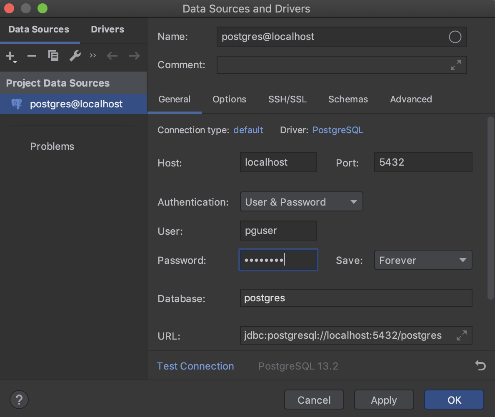
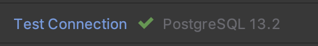
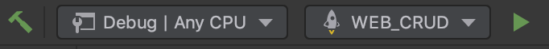

# Web implementation of the system C.R.U.D with MVC template

---
## Technologies and resources used:

* .NET 5.0
* PostgreSQL
* AspNetCore

- EntityFrameworkCore 5.0.8
- Microsoft.VisualStudio.Web.CodeGeneration.Design 5.0.2
- Npgsql.EntityFrameworkCore.PostgreSQL 5.0.1


<h2>Necessary steps to start a project:</h2>

<h1>Before starting:</h1>
1. Check if all the necessary packages and frameworks are installed! <br>
2. Сheck if Postgres is installed on your computer <br>
3. Start Postgre database with name <b>'postgres'</b>, login '<b>pguser</b>', password '<b>password</b>' 
   and port <b>5432</b> 

---

1. `git clone` the project from the current page
```
    $ git clone https://github.com/vasekva/WEB_CRUD-C_SHARP.git <directory_name>
```
    
---
2. Open the project with **JetBrains Rider** or **VisualStudio**:
   1. <h3>JetBrains Rider:</h3>
      
      - Connect to the database through the <b>'Database'</b> tab on the right side
        
        
        
      - Check database connection
        
        
        
      - After loading the project, just click on the start button at the top, or press Shift + F10
        
        
        
      - <h3>Browser will automatically open with the main page you need.<h3>

   2. <h3>VisualStudio:</h3>
      - After loading the project open "Solution Explorer"
    
      
    
      - Double left click on WEB_CRUD.sln
    
      
    
      - In the changed window, start the program by clicking on the start button using IIS Express
    
      
    
      - Oh... one more thing, be sure to check that you have selected the browser to run the application :)
    
      

      - <h3>Browser will automatically open with the main page you need.<h3>
---
3. In the header of the page, you can see two links - Projects and Tasks.
   Each of them redirects to the editing page of the corresponding table, where its contents are displayed
   and entities can be created, updated and deleted. More details about the functionality in a [separate page](./WEB_CRUD/MD_Files/CRUD_Pages.md)
   
   

---
