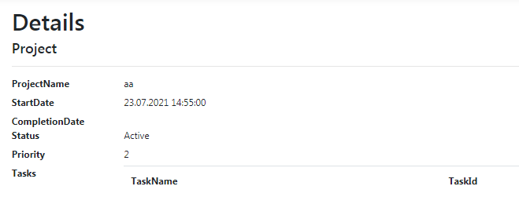

<h1>
    This page displays a list of ALL entity fields in the table
</h1>
<h2>
    Pages have some difference: Project.Details additionally displays
        a list of all tasks that are tied to the ID of this project
</h2>

